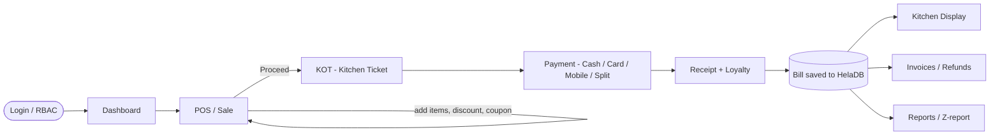
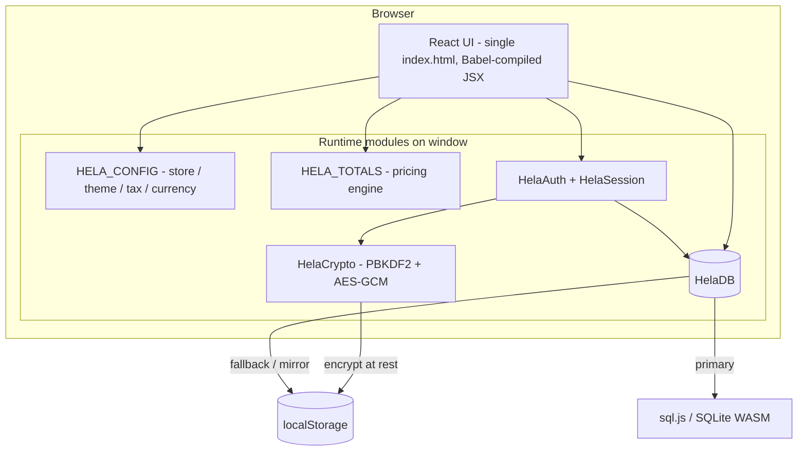
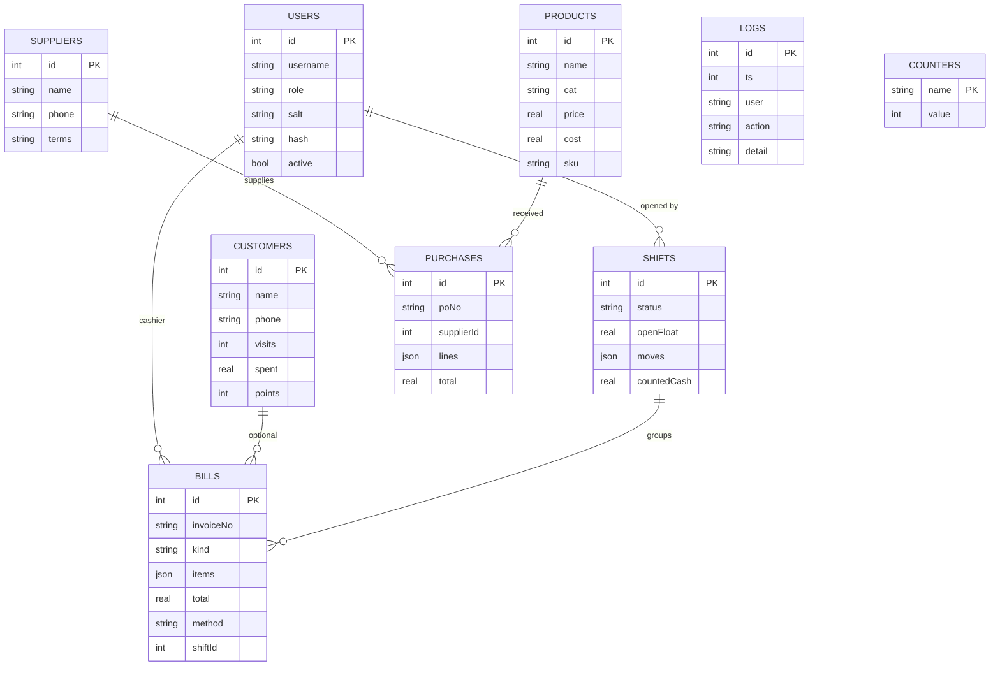

# HelaPOS — Restaurant & Retail Point of Sale

A complete, **offline‑first Point of Sale** built as a single, self‑contained web
application. It started life as a [Claude Design](https://claude.ai/design) HTML
mock‑up of the `LasaKaru/POS` desktop product and has been implemented into a
working, **pro‑grade POS** with real authentication, a real database, and a full
operational feature set.

> **Status:** Web build (Phase 1) — feature‑complete and growing.
> **Next:** a native **WPF / .NET** desktop port (Phase 2) reusing this design + data model.

---

## ✨ Features

| Area | What's included |
|------|-----------------|
| **Sales (POS)** | Category menu + image tiles, cart with per‑line qty / discount / notes, **item modifiers / variants** (size, spice level, add‑ons — priced & shown on KOT/receipt/KDS), **barcode / SKU quick‑add** (type or scan + Enter), hold & recall orders, void (manager‑approved), order types (Dine‑in / Takeaway / Delivery), table selection |
| **Payments** | Cash (quick‑cash + change due), Card, Mobile, and **split / multi‑tender** ("Mixed"); **Kitchen Order Ticket (KOT)** before pay |
| **Pricing engine** | Configurable **tax rate**, **tax‑inclusive** pricing, **service charge**, **rounding** (0.05 / 0.50 / 1), line + order discounts, **coupons / promotions** (`SAVE10`, `WELCOME5`, `VIP20`, `LUNCH15`) |
| **Invoices** | Every sale is saved; searchable history, reprint, CSV export, and **refunds / returns** (partial or full, manager‑approved) |
| **Kitchen Display (KDS)** | Live ticket board — New → Preparing → Ready → Served |
| **Tables & Orders** | Floor‑plan with live status; orders board |
| **Inventory** | Stock levels & adjustments, **cost price + margin**, low‑stock alerts, dish photos, add/edit products |
| **Purchasing** | Suppliers, **goods receiving** (increases stock + updates cost), purchase‑order history |
| **Customers** | CRM list, add/edit, **loyalty points** earned per sale, **store credit** accounts (top‑up / deduct, redeem at payment as a tender or in a split, refund‑to‑credit) |
| **Cashier / Shifts** | Open/close **shift**, cash in/out, **X / Z report** with cash reconciliation |
| **Reports** | Live analytics from real sales — revenue, **profit**, tax collected, COGS, payment mix, sales by category, top sellers; CSV export |
| **Settings** | Store identity & logo, **multi‑currency** (USD / LKR / EUR / GBP / INR / AED / AUD), light/dark theme, accent colour, taxes & charges, receipt header/footer/tax‑ID |
| **Security** | Role‑based access (Admin / Manager / Cashier), **PBKDF2‑hashed passwords**, account lockout, sessions with **inactivity lock / auto‑logout**, lock screen, change password, manager‑authorization overrides, **AES‑256‑GCM encryption at rest**, full **audit log** |
| **Database** | Real **SQLite (WASM)** via sql.js with localStorage fallback, **backup/restore** (`.sqlite` / JSON), live read‑only **SQL console**, schema view, role permission editor |

---

## 🚀 Run & setup

This is a **zero‑build** app — no `npm install`, no bundler. Everything (React,
Babel, sql.js) is loaded from CDN at runtime.

### Option A — open directly
```text
project/ui_kits/helapos/index.html   →  double‑click / open in a modern browser
```

### Option B — serve locally (recommended)
A static server avoids any `file://` quirks and guarantees the secure‑context
crypto features work:

```bash
cd project/ui_kits/helapos

# pick one:
python3 -m http.server 8080
# or
npx serve .
```
Then visit **http://localhost:8080**.

### Requirements
- A modern browser (Chrome, Edge, Firefox, Safari).
- **Internet on first load** to fetch React / Babel / sql.js from CDN.
  - If the CDN is blocked, the app still runs and falls back from SQLite‑WASM to
    an encrypted localStorage store automatically.

### Demo accounts
| Username | Password | Role |
|----------|----------|------|
| `admin` | `admin123` | Administrator (everything) |
| `manager` | `manager123` | Manager (no Users/Database) |
| `cashier` | `cashier123` | Cashier (sell / tables / orders / invoices) |

> Data is stored **locally in your browser** (`localStorage`). Use **Database →
> Reset** to return to seed data, or **Backup/Restore** to move it between machines.

---

## 🔄 Core process flow



**Day‑to‑day:** open a **shift** → take **sales** (KOT → pay → receipt) → kitchen
works the **KDS** board → **invoices** accumulate → **refund** if needed → close the
**shift** with an **X/Z cash count** → review **reports**. Stock is replenished via
**Purchasing → Receive Stock**.

---

## 🧱 Architecture



- **UI:** one `index.html`. React 18 (UMD) + JSX transpiled in‑browser by Babel
  Standalone. Styling is design‑token CSS variables + inline styles (no framework).
- **`HelaDB`:** a document store with an in‑memory mirror as the synchronous source
  of truth; every write is mirrored to **SQLite (WASM)** using *parameterised*
  statements and snapshotted to `localStorage`. Exports a real `.sqlite` file.
- **`HelaCrypto`:** Web Crypto — **PBKDF2‑SHA256** (120k iters, per‑user salt) for
  passwords; **AES‑256‑GCM** for optional encryption at rest. Degrades safely.
- **`HELA_TOTALS`:** the single source of truth for order maths so the cart, KOT,
  payment, receipt and saved bill always agree.

---

## 🗃️ Data model



Each table is stored as `(id INTEGER PRIMARY KEY, doc TEXT)` JSON documents in
SQLite (or as arrays in the localStorage mirror), so the schema is flexible while
remaining queryable — e.g. the built‑in SQL console runs
`SELECT json_extract(doc,'$.name') FROM products`.

### Storage keys (`localStorage`)
| Key | Contents |
|-----|----------|
| `hela.db.v1` | JSON snapshot / mirror of the database |
| `hela.sqlite.v1` | base64 of the SQLite binary (when WASM engine active) |
| `hela.db.enc.v1` | AES‑GCM encrypted DB (when encryption at rest is on) |
| `hela.config.v1` | store settings (theme, currency, tax, receipt…) |
| `hela.session.v1` | current session token + expiry |
| `hela.roles.v1` | role → permission overrides |
| `hela.stock.v1` | per‑product stock levels |
| `hela.photos.v1` | uploaded dish photos |

---

## 📁 Repository structure

```text
HelaPOS/
├── README.md                     ← this file
├── chats/                        ← original design conversation(s)
└── project/
    ├── colors_and_type.css       ← exported design tokens
    ├── App.xaml, Views/, Styles/ ← source WPF/.NET design (port target)
    ├── preview/                  ← static design previews
    └── ui_kits/helapos/
        └── index.html            ← ⭐ THE APP (self-contained web build)
```

> The entire web application is **one file**: `project/ui_kits/helapos/index.html`.
> The `App.xaml` / `Views/*.xaml` / `Styles/*.xaml` files are the original **WPF
> design** the look‑and‑feel was lifted from — they are the target for the Phase‑2
> desktop port.

### Inside `index.html`
1. **CSS** — design tokens (colours, type, spacing, light/dark themes).
2. **Data & runtime modules** (`<script>`): `HELA_DATA`, `HELA_CONFIG`,
   `HELA_CURRENCIES`, `HELA_TOTALS`, `HELA_ROLES`, `HelaCrypto`, `HelaDB`,
   `HelaSession`, `HelaAuth`.
3. **React app** (`<script type="text/babel">`): primitives → screens
   (Login, Dashboard, POS, Payment, Receipt, Tables, Orders, Kitchen, Invoices,
   Inventory, Purchasing, Customers, Cashier, Reports, Users, Audit, Database,
   Settings) → `App` shell → async boot gate.

---

## 🔐 Security notes

The app implements RBAC, hashed passwords, lockout, sessions, encryption‑at‑rest and
an audit trail. **However, this is client‑side security suitable for a prototype /
single‑device deployment.** Anything in the browser (localStorage, hashes) is
inspectable by the user. For a production multi‑user deployment, auth, RBAC and the
database **must be enforced server‑side** (or by the native app against a protected
local DB). This is exactly what the Phase‑2 WPF port and/or a backend API will add.

---

## 🗺️ Roadmap

**Phase 1 — Web (current)**
- [x] Auth, RBAC, sessions, lock, encryption, audit
- [x] SQLite (WASM) persistence + backup/restore + SQL console
- [x] POS, KOT, payments (incl. split), receipts, loyalty
- [x] Multi‑currency, configurable tax / service / rounding, coupons
- [x] Invoices, refunds, shifts (X/Z), reports from real data
- [x] Inventory + cost, purchasing/goods‑receiving, customers
- [x] Barcode quick‑add, Kitchen Display System
- [x] Item modifiers / variants (size, spice, add‑ons) with per‑product editor
- [x] Store credit / customer accounts (top‑up, redeem at POS, refund‑to‑credit)
- [ ] Table merge / transfer
- [ ] Rule‑based promotions, multi‑store + backend sync

**Phase 2 — Native WPF / .NET desktop**
- [ ] Port screens onto the original WPF design
- [ ] Real SQLite file + server‑enforced auth/roles
- [ ] Hardware: receipt printer, cash drawer, barcode scanner

---

## 🧪 Tech stack

- **Frontend:** React 18 + JSX (Babel Standalone, in‑browser), CSS custom properties
- **Database:** SQLite compiled to WebAssembly (sql.js) with a localStorage fallback
- **Security:** Web Crypto API (PBKDF2‑SHA256, AES‑256‑GCM)
- **Persistence:** browser `localStorage`
- **Build:** none — open the file or serve statically
- **Design source:** WPF / .NET 9 (`App.xaml`, `Styles/*.xaml`, `Views/*.xaml`)
